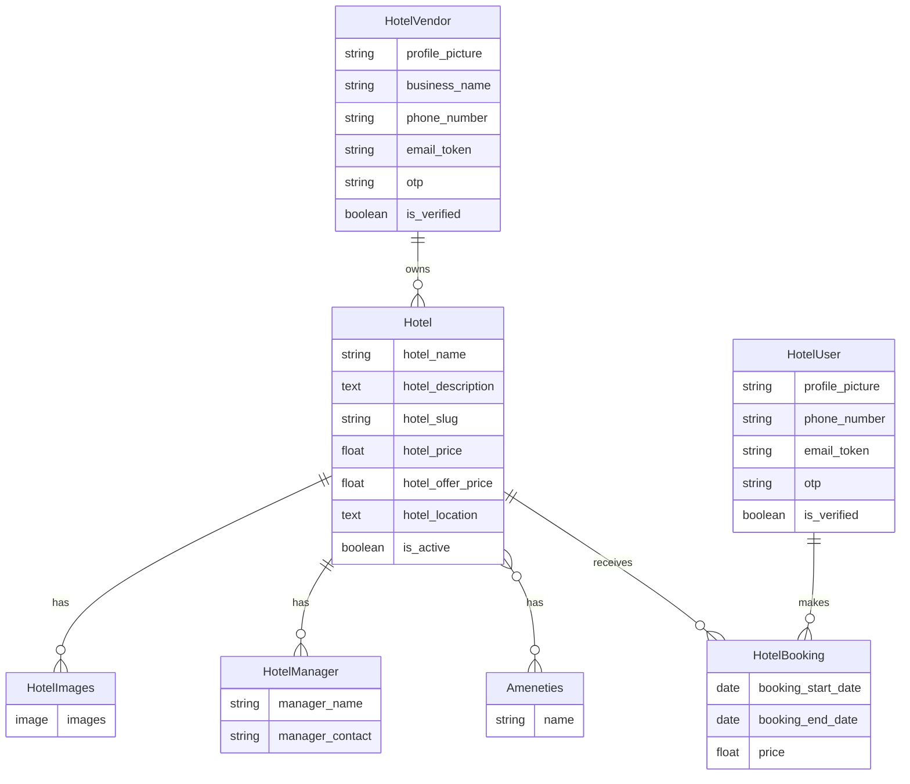

<](https://python.org)
[](https://djangoproject.com)
[](https://getbootstrap.com)
[](https://mysql.com)
[](LICENSE)

**AuraStays** is a full-featured hotel booking platform inspired by OYO, built with Django. It provides a seamless experience for travelers to discover and book premium stays, and a powerful vendor dashboard for hotel owners to manage listings, track bookings, and monitor revenue.

[Features](#-features) · [Tech Stack](#-tech-stack) · [Getting Started](#-getting-started) · [Screenshots](#-screenshots) · [Project Structure](#-project-structure) · [API Routes](#-api-routes) · [Contributing](#-contributing)

</div>

---

## ✨ Features

### 🧳 For Travelers
- **Browse Hotels** — Explore a curated collection of premium hotels across India
- **Search & Filter** — Search hotels by name or location with real-time AJAX filtering
- **Sort by Price** — Sort results by price (low → high or high → low)
- **Hotel Details** — View image gallery, amenities, pricing, and location info
- **Date-Based Booking** — Book hotels by selecting check-in and check-out dates with auto price calculation
- **Trending Destinations** — Dynamically generated trending locations based on hotel density

### 🏢 For Hotel Vendors
- **Vendor Dashboard** — Analytics overview with total hotels, bookings, and revenue metrics
- **Hotel Management** — Add, edit, and manage hotel listings
- **Image Upload** — Upload and manage multiple images per hotel
- **Amenities System** — Assign amenities (WiFi, Pool, AC, Gym, etc.) via interactive chip-based selectors
- **Booking Tracking** — View all bookings across all owned properties

### 🔐 Authentication
- **Dual Auth System** — Separate registration & login flows for travelers and vendors
- **Email Verification** — Token-based email verification for account activation
- **OTP Login** — Passwordless login via email-based OTP
- **Secure Passwords** — Passwords hashed using Django's built-in `set_password()` with PBKDF2

### 🎨 UI/UX
- **Glassmorphism Design** — Frosted glass navbar, auth cards, and UI elements
- **Smooth Animations** — Scroll-triggered fade-up animations and hover effects
- **Responsive Layout** — Mobile-first design with Bootstrap 5 grid system
- **Modern Typography** — Inter font family with clean, weighted hierarchy

---

## 🛠 Tech Stack

| Layer         | Technology                                                                 |
|---------------|---------------------------------------------------------------------------|
| **Backend**   | Python 3.10+, Django 5.2                                                  |
| **Frontend**  | HTML5, CSS3, JavaScript, Bootstrap 5.3                                    |
| **Database**  | MySQL 8.0                                                                 |
| **Icons**     | Font Awesome 6.4                                                          |
| **Email**     | Django SMTP (Gmail)                                                       |
| **Templating**| Django Template Engine (Jinja-like)                                       |

---

## 🚀 Getting Started

### Prerequisites

- **Python** 3.10 or higher
- **MySQL** 8.0 or higher
- **pip** (Python package manager)

### 1. Clone the Repository

```bash
git clone https://github.com/Porushjain1/AuraStays.git
cd AuraStays
```

### 2. Create & Activate Virtual Environment

```bash
python -m venv venv

# macOS/Linux
source venv/bin/activate

# Windows
venv\Scripts\activate
```

### 3. Install Dependencies

```bash
pip install django mysqlclient pillow
```

### 4. Configure the Database

Create a MySQL database named `oyo_clone`:

```sql
CREATE DATABASE oyo_clone;
```

Then update the database credentials in `oyo_clone/settings.py`:

```python
DATABASES = {
    'default': {
        'ENGINE': 'django.db.backends.mysql',
        'NAME': 'oyo_clone',
        'USER': 'your_mysql_user',
        'PASSWORD': 'your_mysql_password',
        'HOST': 'localhost',
        'PORT': '3306',
    }
}
```

### 5. Configure Email (Optional)

To enable email verification and OTP login, update the email settings in `oyo_clone/settings.py`:

```python
EMAIL_HOST_USER = "your_email@gmail.com"
EMAIL_HOST_PASSWORD = "your_app_password"  # Use Gmail App Password
```

> **Note:** Generate a [Gmail App Password](https://support.google.com/accounts/answer/185833) for `EMAIL_HOST_PASSWORD`.

### 6. Run Migrations

```bash
python manage.py makemigrations
python manage.py migrate
```

### 7. Seed Sample Data (Optional)

Populate the database with 18 sample hotels across Indian cities:

```bash
python seed_hotels.py
```

Add default amenities:

```bash
python add_amenities.py
```

### 8. Create a Superuser

```bash
python manage.py createsuperuser
```

### 9. Run the Development Server

```bash
python manage.py runserver
```

Visit **http://127.0.0.1:8000** in your browser 🎉

---

## 📸 Screenshots

> _Screenshots coming soon — Run the project locally to see the full UI!_

---

## 📁 Project Structure

```
AuraStays/
├── manage.py                    # Django management script
├── seed_hotels.py               # Database seeder (18 premium hotels)
├── add_amenities.py             # Amenities seeder script
│
├── oyo_clone/                   # Django project settings
│   ├── settings.py              # Main configuration
│   ├── urls.py                  # Root URL router
│   ├── wsgi.py                  # WSGI entry point
│   └── asgi.py                  # ASGI entry point
│
├── home/                        # Home app (public-facing pages)
│   ├── views.py                 # Homepage, hotel details, search, booking
│   ├── urls.py                  # Home URL patterns
│   └── templates/
│       ├── index.html           # Homepage with search, trending, hotel grid
│       ├── hotel_detail.html    # Hotel details page with gallery & booking
│       ├── hotel_list_partial.html  # AJAX partial for filtered hotel list
│       └── utils/
│           ├── base.html        # Base template (navbar + footer)
│           └── navbar.html      # Glassmorphism navigation bar
│
├── accounts/                    # Accounts app (auth + vendor management)
│   ├── models.py                # HotelUser, HotelVendor, Hotel, Booking, etc.
│   ├── views.py                 # Auth flows, vendor dashboard, hotel CRUD
│   ├── urls.py                  # Account URL patterns
│   ├── utils.py                 # Token generation, email sending, slug utils
│   └── templates/
│       ├── login.html           # User login page
│       ├── register.html        # User registration page
│       ├── verify_otp.html      # OTP verification page
│       └── vendor/
│           ├── login_vendor.html      # Vendor login
│           ├── register_vendor.html   # Vendor registration
│           ├── vendor_dashboard.html  # Analytics dashboard
│           ├── vendor_hotels.html     # Hotel listing management
│           ├── vendor_bookings.html   # Booking management
│           ├── add_hotel.html         # Add new hotel form
│           ├── edit_hotel.html        # Edit hotel details
│           └── upload_image.html      # Hotel image upload
│
├── public/static/               # Static assets
│   ├── css/style.css            # Custom stylesheet (glassmorphism, animations)
│   └── js/main.js               # Client-side JavaScript
│
└── hotels/                      # Uploaded hotel images (media)
```

---

## 🗺 API Routes

### Public Routes

| Method | Route                  | Description                      |
|--------|------------------------|----------------------------------|
| GET    | `/`                    | Homepage with hotel listings     |
| GET    | `/?search=<query>`     | Search hotels by name / location |
| GET    | `/?sort_by=sort_low`   | Sort hotels by price (ascending) |
| GET    | `/?sort_by=sort_high`  | Sort hotels by price (descending)|
| GET    | `/hotel/<slug>/`       | Hotel detail page                |
| POST   | `/hotel/<slug>/`       | Book a hotel (authenticated)     |

### Auth Routes (`/accounts/`)

| Method   | Route                          | Description               |
|----------|--------------------------------|---------------------------|
| GET/POST | `/accounts/login/`             | User login                |
| GET/POST | `/accounts/register/`          | User registration         |
| GET/POST | `/accounts/login-vendor/`      | Vendor login              |
| GET/POST | `/accounts/register-vendor/`   | Vendor registration       |
| GET      | `/accounts/verify-account/<token>/` | Email verification   |
| GET      | `/accounts/send_otp/<email>/`  | Send OTP to email         |
| GET/POST | `/accounts/verify-otp/<email>/`| Verify OTP                |
| GET      | `/accounts/logout/`            | Logout                    |

### Vendor Routes (`/accounts/`) — Login Required

| Method   | Route                              | Description              |
|----------|------------------------------------|--------------------------|
| GET      | `/accounts/dashboard/`             | Vendor analytics dashboard |
| GET      | `/accounts/vendor-hotels/`         | List vendor's hotels     |
| GET      | `/accounts/vendor-bookings/`       | List vendor's bookings   |
| GET/POST | `/accounts/add-hotel/`             | Add a new hotel          |
| GET/POST | `/accounts/edit-hotel/<slug>/`     | Edit hotel details       |
| GET/POST | `/accounts/upload-images/<slug>/`  | Upload hotel images      |
| GET      | `/accounts/delete_image/<id>/`     | Delete a hotel image     |

---

## 🗄 Database Models



---

## 🤝 Contributing

Contributions are welcome! Here's how you can help:

1. **Fork** the repository
2. **Create** a feature branch (`git checkout -b feature/amazing-feature`)
3. **Commit** your changes (`git commit -m 'Add amazing feature'`)
4. **Push** to the branch (`git push origin feature/amazing-feature`)
5. **Open** a Pull Request

---

## 📄 License

This project is open source and available under the [MIT License](LICENSE).

---

<div align="center">

**Built with ❤️ by [Porush Jain](https://github.com/Porushjain1)**

⭐ Star this repo if you found it helpful!

</div>
]]>
